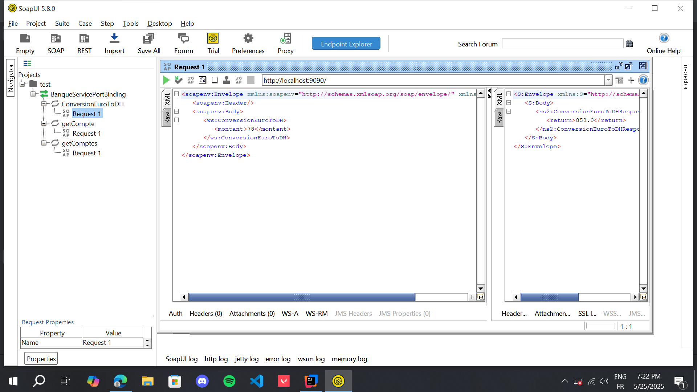
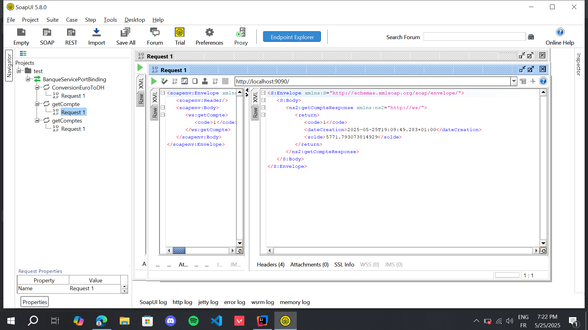
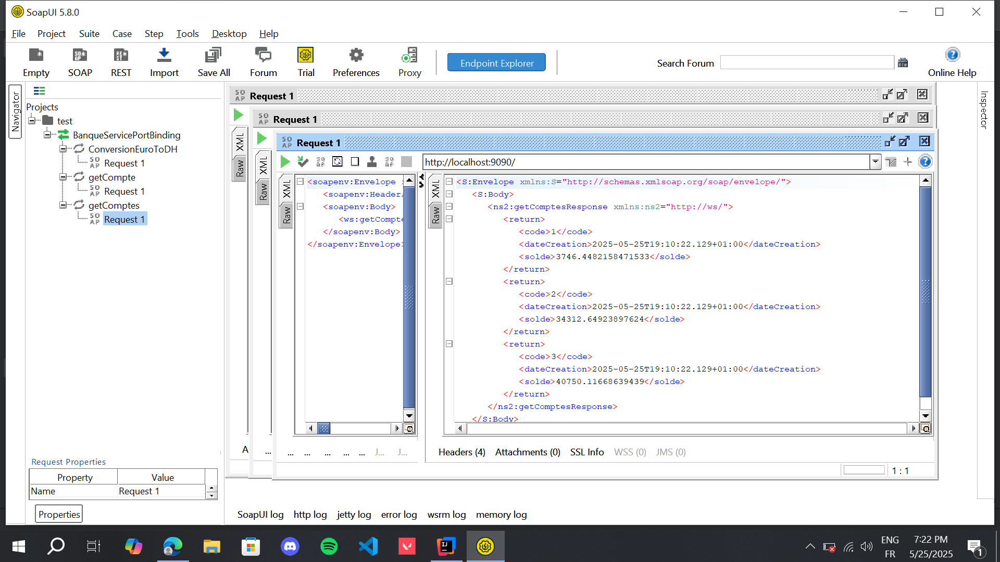
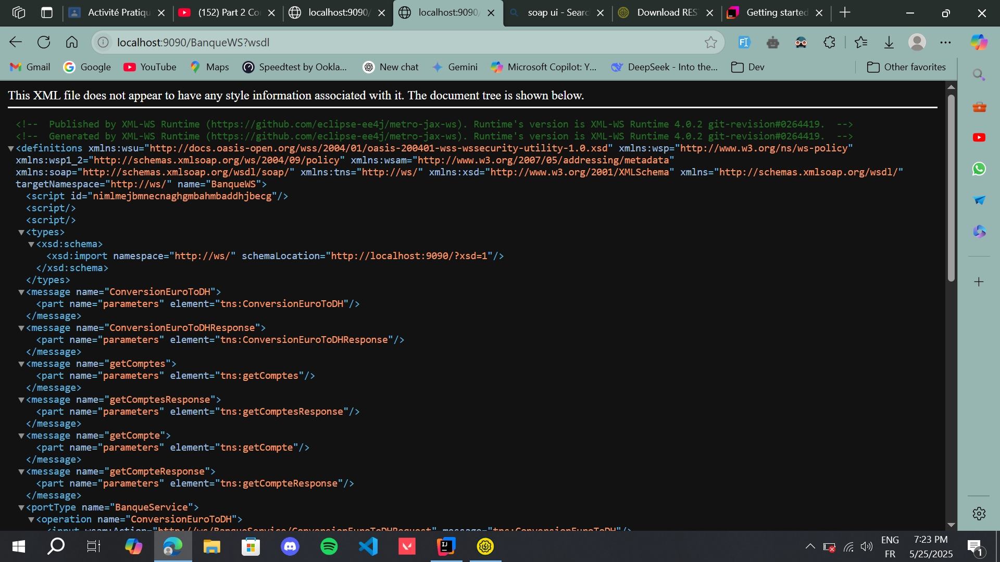
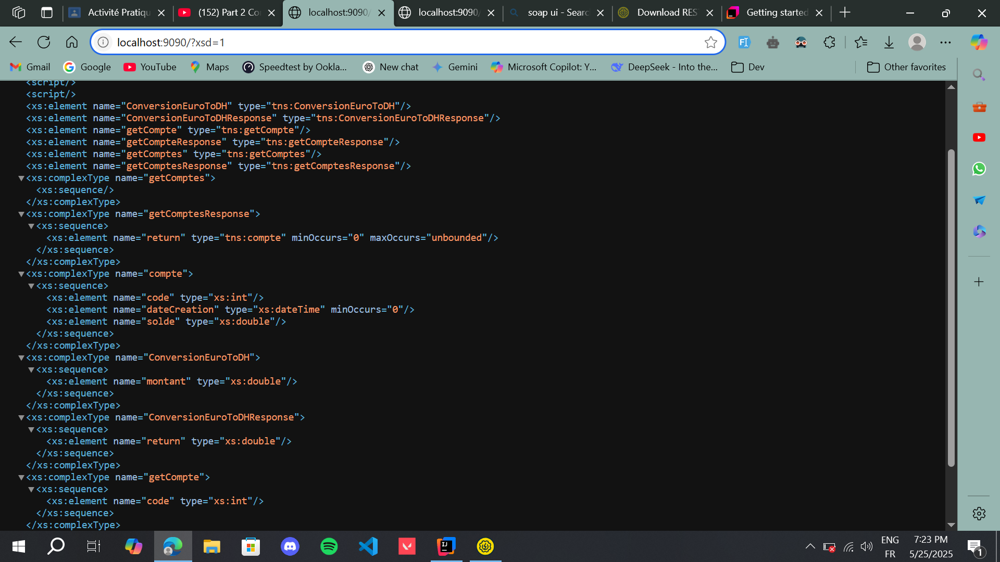
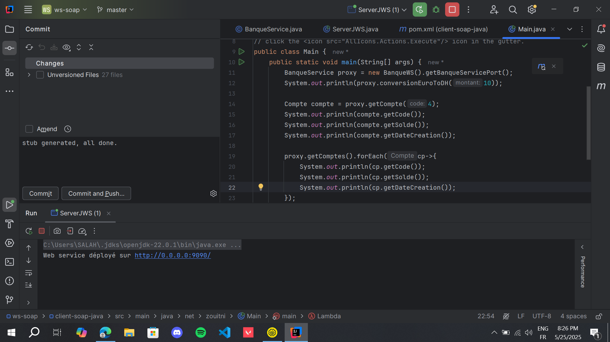

# WS-SOAP-Zouitni

A simple SOAP-based web service developed in Java using **JAX-WS**. This project demonstrates how to expose a banking service (`BanqueService`) over HTTP and interact with it using tools such as SOAP UI.

---

## ✨ Features

* Exposes a `BanqueService` with multiple SOAP operations
* Deploys locally on `http://localhost:9090/`
* Generates WSDL and XSD dynamically
* Testable with SOAP UI

---

## 🚀 How to Run

1. Open the project in **IntelliJ IDEA** or any Java IDE.
2. Navigate to `ServerJWS.java` in the `ws-soap` module.
3. Run the file as a Java application.

You should see the output:

```
Web service déployé sur http://0.0.0.0:9090/
```

---

## 🔗 Endpoints

* **WSDL:** [`http://localhost:9090/BanqueWS?wsdl`](http://localhost:9090/BanqueWS?wsdl)
* **XSD:** [`http://localhost:9090/?xsd=1`](http://localhost:9090/?xsd=1)

---

## 📂 Project Structure

```
ws-soap-zouitni/
├── ws-soap/
│   ├── src/
│   │   └── ... (BanqueService.java, ServerJWS.java)
├── screenshots/
│   ├── conversion.png
│   ├── getcompte.png
│   ├── getcomptes.png
│   ├── wsdl.png
│   ├── xsdFile.png
│   └── serverrun.png
└── README.md
```

---

## 🧪 SOAP UI Testing

> You can test the service using [SOAP UI](https://www.soapui.org/).

### Steps:

1. Open SOAP UI.
2. Create a new SOAP project.
3. Enter the WSDL URL: `http://localhost:9090/BanqueWS?wsdl`
4. Invoke available operations (e.g., `convert`, `getCompte`, `getComptes`).

---

## 📸 Screenshots

### 🧾 SOAP UI Requests and Responses

#### 🔁 `convert` Operation



#### 📘 `getCompte` Operation



#### 📚 `getComptes` Operation



---

### 📄 WSDL and XSD Output

#### WSDL - `http://localhost:9090/BanqueWS?wsdl`



#### XSD - `http://localhost:9090/?xsd=1`



---

### 🖥️ Server Console Output



---

## 📚 Technologies Used

* Java 17+
* Jakarta JAX-WS
* IntelliJ IDEA
* SOAP UI

---

## 👤 Author

**Zouitni Salah Eddine**
GitHub: [@BR1WA](https://github.com/BR1WA)

---

## 📝 License

This project is licensed under the [MIT License](LICENSE).
